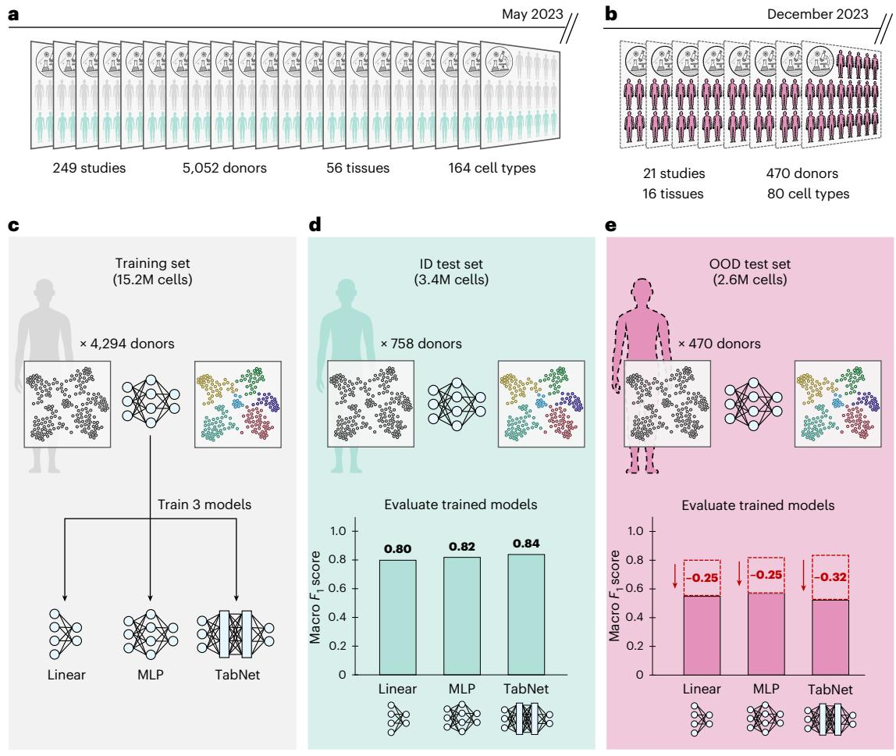
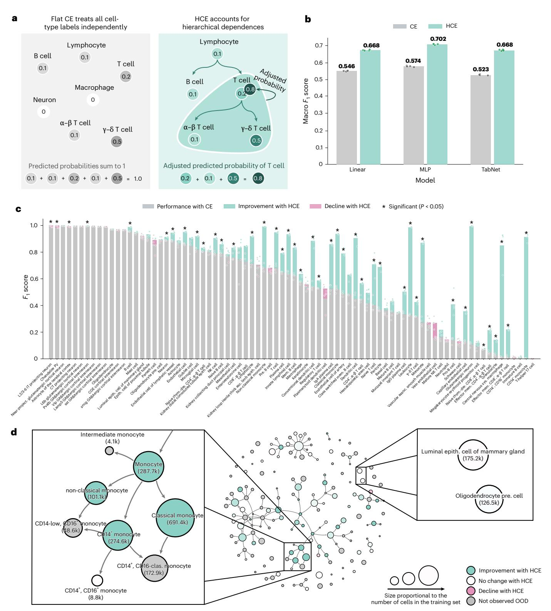

# Nature Computational Science

**Brief Communication** 

https://doi.org/10.1038/s43588-025-00945-z

## Improving atlas-scale single-cell annotation models with hierarchical cross-entropy loss

**Received:** 28 May 2025  
**Accepted:** 12 December 2025  
**Published online:** 30 January 2026  
**Check for updates**

**Authors:** Sebastiano Cultrera di Montesano, Davide D'Ascenzo, Srivatsan Raghavan, Ava P. Amini, Peter S. Winter & Lorin Crawford

## Document Structure

This document is organized into the following sections:

1. [Abstract](#abstract)
2. [Introduction](#introduction)
3. [Results](#results)
4. [Discussion](#discussion)
5. [Methods](#methods)
6. [References](#references)

## Chapter Navigation

### Abstract

Accurately annotating cell types is essential for extracting biological insight from single-cell RNA sequencing data. Although cell types are naturally organized into hierarchical ontologies, most computational models do not explicitly incorporate this structure into their training objectives. Here, we introduce a hierarchical cross-entropy loss that aligns model objectives with biological structure. Applied to architectures ranging from linear models to transformers, this simple modification improves out-of-distribution performance by 12–15% without added computational cost.

**Full content:** [Abstract](chapters/abstract.md)

### Introduction

Cell-type annotation is a core step in single-cell RNA sequencing (RNA-seq) pipelines. The quality of annotations directly impacts downstream analyses, including mapping cellular diversity across tissues and deciphering cell-type-specific regulatory mechanisms.

**Full content:** [Introduction](chapters/introduction.md)

### Results

This section presents the main findings of the study, including out-of-distribution performance challenges, the hierarchical cross-entropy loss, and performance improvements across different model architectures.

**Full content:** [Results](chapters/results.md)

### Discussion

This section discusses the implications of the findings, rethinking model complexity vs. biological structure, and future directions for research.

**Full content:** [Discussion](chapters/discussion.md)

### Methods

This section describes the training and evaluation datasets, cell ontology, evaluation protocol, model details, HCE loss function, and statistical evaluation methods.

**Full content:** [Methods](chapters/methods.md)

### References

This section provides the complete list of references cited in the article, following the Springer Nature format.

**Full content:** [References](chapters/references.md)

## Figures

### Figure 1: Evaluating model generalization in continuously updated single-cell atlases

**Description:** Evaluating model generalization in continuously updated single-cell atlases reveals sharp OOD performance drops for the annotation task.

### Figure 2: HCE loss improves performances across architectures

**Description:** The HCE loss improves macro F1 scores by 12–15% on OOD evaluations across the linear classifier, MLP and TabNet.

## Additional Information

**Supplementary information** The online version contains supplementary material available at <https://doi.org/10.1038/s43588-025-00945-z>.

**Correspondence and requests for materials** should be addressed to Sebastiano Cultrera di Montesano, Peter S. Winter or Lorin Crawford.

**Peer review information** *Nature Computational Science* thanks Anshul Kundaje and the other, anonymous, reviewer(s) for their contribution to the peer review of this work. Peer reviewer reports are available. Primary Handling Editor: Kaitlin McCardle and Michelle Badri, in collaboration with the *Nature Computational Science* team.

**Reprints and permissions information** is available at [www.nature.com/reprints](http://www.nature.com/reprints).

**Publisher's note** Springer Nature remains neutral with regard to jurisdictional claims in published maps and institutional affiliations. **Open Access** This article is licensed under a Creative Commons Attribution 4.0 International License, which permits use, sharing, adaptation, distribution and reproduction in any medium or format, as long as you give appropriate credit to the original author(s) and the source, provide a link to the Creative Commons licence, and indicate if changes were made. The images or other third party material in this article are included in the article's Creative Commons licence, unless indicated otherwise in a credit line to the material. If material is not included in the article's Creative Commons licence and your intended use is not permitted by statutory regulation or exceeds the permitted use, you will need to obtain permission directly from the copyright holder. To view a copy of this licence, visit [http://creativecommons.org/licenses/by/4.0/](http://creativecommons.org/licenses/by/4.0/).

© The Author(s) 2026, modified publication 2026

## Chapter Files

The complete document is available as separate chapter files for easier navigation and processing:

- [Abstract](chapters/abstract.md)
- [Introduction](chapters/introduction.md)
- [Results](chapters/results.md)
- [Discussion](chapters/discussion.md)
- [Methods](chapters/methods.md)
- [References](chapters/references.md)